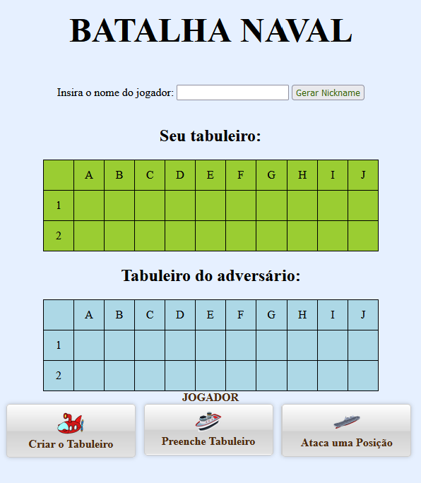

# Batalha Naval
 Jogo da batalha naval, em HTML, CSS e JS

Desenvolvida no **_*âmbito da ação da disciplina*_** **"Sistemas de Informação"**

## Operações suportadas

Esta aplicação vai implementar as seguintes operações:

- Criar NickName do Jogador
- Criar Tabuleiro
- Preencher Tabuleiro
- Atacar uma posição 

## Tecnologias utilizadas neste projeto

- **Visual Studio Code**
- Git
- GitHub
- GitHub Desktop
- Plataforma GitHub
- HTML
- CSS
- JavaScript

## Site oficial

*A aplicação ainda está em desenvolvimento. O site oficial será fornecido mais tarde.*

Faça download desta aplicação no site oficial: [www.batalhanaval.com](https://www.batalhanaval.com)